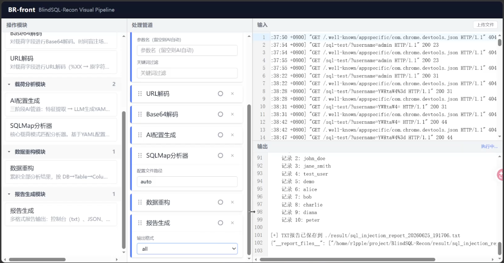

# SQL 盲注分析管道

## 项目概述

由于盲注攻击无法直接从响应中获得数据，运维人员很难通过流量包直接识别被盗数据。本项目旨在自动化分析和重构盲注攻击泄露的数据。通过解析 Web 服务器日志、解码恶意载荷、分析 SQL 盲注模式，并重构被盗数据，帮助运维人员从间接的盲注攻击中恢复敏感信息。

### 支持的盲注payload解析类型

- **布尔盲注**：通过**真/假响应**推断数据内容
- **时间盲注**：通过**响应延迟**推断数据内容

主要为识别字节数大小

### 可视化演示视频

[可视化演示视频.mp4](./可视化演示视频.mp4)



### 支持的日志格式

- **通用日志格式**

  ```log
  %h %l %u %t \"%r\" %>s %b
  ```

- **组合日志格式**

  ```log
  %h %l %u %t \"%r\" %>s %b \"%{Referer}i\" \"%{User-Agent}i\"
  ```

## 项目架构

```
├─1_log_parser/          # 日志解析模块
│  ├─1_web_log_parser.py     # Web日志格式解析
│  ├─2_param_detector.py     # AI参数检测器（LLM自动识别注入参数）
│  └─3_param_extractor.py    # 参数提取（支持AI自动检测）
├─2_payload_decoder/     # 载荷解码模块
│  ├─url_decoder.py          # URL解码
│  └─base64_decoder.py       # Base64解码（可选，时间盲注常用）
├─3_payload_analyzer/    # 载荷分析模块
│  ├─ai_config_generator.py  # AI配置生成器（LLM自动生成分析器配置）
│  ├─sqlmap_analyzer.py      # SQLMap盲注分析器
│  └─config/                 # 预置及AI生成的配置文件
├─4_data_reconstructor/  # 数据重构模块
│  └─default_data_reconstructor.py  # 二分法字符重构
├─5_report_generator/    # 报告生成模块
│  └─default_report_generator.py    # 多格式报告输出
└─log_example/           # 示例日志文件
   ├─bool_access.log           # 布尔盲注示例
   └─time_access.log           # 时间盲注示例
```

## 安装与依赖

### 环境要求

- Python 3.6+
- PyYAML
- openai (AI参数检测需要)

安装依赖：

```bash
pip install pyyaml openai
```

### 配置 AI 参数检测（可选）

如需使用 AI 自动检测注入参数，在项目根目录创建 `.env` 文件：

```bash
DEEPSEEK_API_KEY=sk-xxxxxxxxxxxxxxxxxxxxxxxxxxxxxxxx
```

支持所有与 OpenAI SDK 兼容的 API（DeepSeek、OpenAI 等），可在 `2_param_detector.py` 修改 `base_url` 和 `model`。

### 获取项目

```bash
git clone https://github.com/R1pplon/BlindSQL-Recon.git
cd BlindSQL-Recon
```

## 快速开始

### 基本使用流程

**方式一：AI 全自动（推荐，无需任何人工介入）**

```bash
cat ./log_example/bool_access.log | \
python ./1_log_parser/1_web_log_parser.py | \
python ./1_log_parser/2_param_detector.py | \
python ./1_log_parser/3_param_extractor.py | \
python ./2_payload_decoder/url_decoder.py | \
python ./3_payload_analyzer/ai_config_generator.py | \
python ./3_payload_analyzer/sqlmap_analyzer.py --config auto | \
python ./4_data_reconstructor/default_data_reconstructor.py | \
python ./5_report_generator/default_report_generator.py -o txt
```

**方式二：手动指定参数 + 手动配置**

```bash
cat ./log_example/bool_access.log | \
python ./1_log_parser/1_web_log_parser.py | \
python ./1_log_parser/3_param_extractor.py -p username | \
python ./2_payload_decoder/url_decoder.py | \
python ./3_payload_analyzer/sqlmap_analyzer.py --config ./3_payload_analyzer/config/test_boolean_config.yaml | \
python ./4_data_reconstructor/default_data_reconstructor.py | \
python ./5_report_generator/default_report_generator.py -o txt
```

**时间盲注（Time-based）示例（AI全自动）：**

```bash
cat ./log_example/time_access.log | \
python ./1_log_parser/1_web_log_parser.py | \
python ./1_log_parser/2_param_detector.py | \
python ./1_log_parser/3_param_extractor.py | \
python ./2_payload_decoder/url_decoder.py | \
python ./2_payload_decoder/base64_decoder.py | \
python ./3_payload_analyzer/ai_config_generator.py | \
python ./3_payload_analyzer/sqlmap_analyzer.py --config auto | \
python ./4_data_reconstructor/default_data_reconstructor.py | \
python ./5_report_generator/default_report_generator.py -o csv
```

**3_param_extractor.py** 支持两种参数传入方式：
- **AI 自动检测**（推荐）：由 `2_param_detector.py` 通过 LLM 分析采样日志，自动识别注入参数名
- **手动指定**：`-p <参数名>` 明确指定（优先级高于 AI 检测）

**sqlmap_analyzer.py** 支持两种配置方式：
- **AI 自动生成**（推荐）：`--config auto`，由 `ai_config_generator.py` 通过 LLM 分析 payload 样本，自动生成分析器 YAML 配置
- **手动指定**：`--config <path>`，使用预置或手写的 YAML 配置文件

> **注意**：`base64_decoder.py` 仅在 payload 实际经过 Base64 编码时才需要加入管道。

## 各模块功能说明

### 1. 日志解析器 `1_web_log_parser.py`

解析常见的 Web 服务器日志格式（通用日志格式和组合日志格式），将非结构化日志转换为结构化 JSON 数据。

支持格式：

- **通用日志格式**：`remote_host remote_logname remote_user [timestamp] "request_line" status_code response_size`
- **组合日志格式**：添加了 `Referer` 和 `User-Agent` 字段

### 2. AI 参数检测器 `2_param_detector.py`

通过 LLM（DeepSeek）自动识别日志中携带 SQL 注入 payload 的 URL 参数名。流程：

1. 全量读入 JSON 行数据
2. 随机采样 100 条
3. 按 URL 路径聚合参数名及取值
4. 构造 YAML 格式采样数据发送给 LLM
5. LLM 返回注入参数名
6. 输出元数据行 + 透传全量数据

需要设置 `DEEPSEEK_API_KEY` 环境变量或 `.env` 文件。

### 3. 参数提取器 `3_param_extractor.py`

从结构化日志中提取特定参数，过滤出潜在的恶意请求。支持两种参数来源：

- **AI 自动检测**（默认）：接收 `2_param_detector.py` 的检测结果，无需手动指定参数
- **手动指定**：`-p <参数名>` 明确指定（会覆盖 AI 检测结果）

使用方法：

```bash
# AI 模式（配合 2_param_detector.py）
... | python 2_param_detector.py | python 3_param_extractor.py

# 手动模式
python 3_param_extractor.py -p <parameter_name>
```

### 4. 载荷解码器 `url_decoder.py`, `base64_decoder.py`

对提取的载荷进行多层解码，还原攻击者的原始输入：

- URL 解码：处理 `%20` 等编码字符
- Base64 解码：处理 Base64 编码的载荷

### 5. AI 配置生成器 `ai_config_generator.py`

通过 LLM（DeepSeek）自动生成 `sqlmap_analyzer.py` 所需的 YAML 配置文件，消除人工编写正则和阈值配置的需求。

三步流程：
1. **特征提取**：响应大小聚类、注入类型推断、结构去重、多样化采样
2. **语义转换**：特征摘要 → LLM → YAML 配置
3. **闭环校验**：5 级验证链（语法 → 正则编译 → 匹配率 → 提取完备性 → ASCII 有效性）

校验通过后，配置保存到 `3_payload_analyzer/config/ai_generated_<ts>.yaml`，失败时支持最多 3 次重试（带错误反馈），全部失败则降级为模板配置。

使用方法：
```bash
# 配合 --config auto 模式
... | python ai_config_generator.py | python sqlmap_analyzer.py --config auto
```

### 6. SQLMap 盲注分析器 `sqlmap_analyzer.py`

核心分析模块，使用可配置规则识别和解析盲注攻击模式。配置使用 YAML 格式。

支持两种配置来源：
- **AI 自动生成**：`--config auto`（配合 `ai_config_generator.py`）
- **手动指定**：`--config <path>`（使用预置或手写 YAML）

配置文件示例 `test_boolean_config.yaml`:

```yaml
injection_type: boolean
trigger_pattern: ORD(MID(
judge_function:
  type: size_equal
  value: 15
patterns:
  from_pattern: "FROM\\s+([\\w_]+)\\.([\\w_]+)"
  cast_pattern: "CAST\\(([\\w_]+)\\s+AS"
  limit_pattern: "LIMIT\\s+(\\d+),1"
  position_pattern: ",(\\d+),1\\)\\)"
  comparison_pattern: "\\)\\)\\s*([<>!]=?)\\s*(\\d+)"
```

### 7. 数据重构器 `default_data_reconstructor.py`

将分散在多次请求中的碎片化信息拼凑成完整数据，通过模拟二分查找算法重构原始字符。

### 8. 报告生成器 `default_report_generator.py`

生成多种格式的分析报告，包括：

- 控制台输出
- JSON 格式报告
- CSV 格式报告
- 文本格式报告

使用方法：

```bash
python default_report_generator.py -o [json|csv|txt|all]
```

## 配置说明

### 分析器配置

分析器的行为由 YAML 配置文件定义，主要包含以下部分：

- **injection_type**: 盲注类型（boolean/time）
- **trigger_pattern**: 识别盲注载荷的关键模式
- **judge_function**: 定义如何根据HTTP响应判断查询结果
  - size_equal: 响应大小**等于**特定值
  - size_less: 响应大小**小于**特定值
  - size_greater: 响应大小**大于**特定值
  - size_range: 响应大小在**特定范围**内
- **patterns**: 用于提取攻击元数据的正则表达式模式

### 自定义配置

配置模板见 `./3_payload_analyzer/config/analyzer_config.yaml`，可根据实际应用场景进行自定义：

1. 分析应用的正常响应特征，确定 TRUE/FALSE 响应体大小阈值
2. 设置 `judge_function` 的 type 和 value
3. 若攻击者 payload 格式与 SQLMap 默认不同，调整 patterns 中的正则表达式

预置配置文件：
- `test_boolean_config.yaml` — 布尔盲注分析配置
- `test_time_config.yaml` — 时间盲注分析配置

## 输出示例

### 控制台输出

```
============================================================
SQL盲注攻击分析报告
============================================================

[+] 目标数据库: app_db

[+] 被攻击的表:
    - users
    - products

[+] 发现的列结构:
    app_db.users:
      - username
      - password
      - email

[+] 表 users.username 中被盗数据:
    记录 1: admin
    记录 2: testuser
    记录 3: john_doe
```

### CSV 输出

报告生成器会创建包含以下内容的目录：

```
./result/csv_report_20230918_143022/
├── metadata.csv
├── users.csv
└── products.csv
```

## 应用场景

1. **安全事件响应**：在发生数据泄露事件后，快速确定泄露范围和内容
2. **渗透测试验证**：验证盲注攻击的有效性和效率
3. **安全监控**：集成到SIEM系统中，检测正在进行的盲注攻击
4. **取证分析**：为法律程序提供数据泄露的证据
5. **安全研究**：学习SQL盲注攻击原理和防御措施
